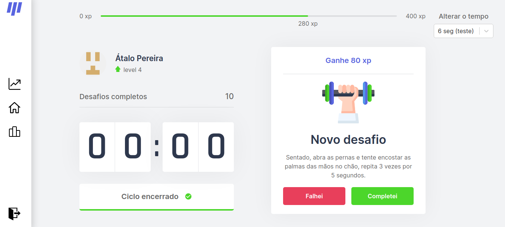
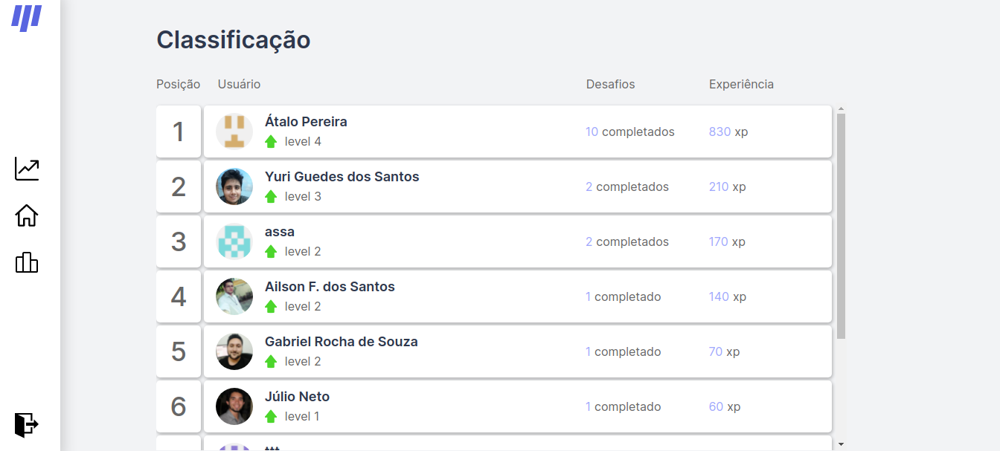
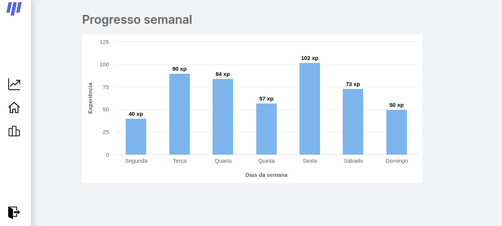

<h1 align="center">
  
</h1>

## 💻 Telas do sistema

### Home


### Classificação do usuário


### Progresso semanal do usuário


## ✨ Tecnologias

Esse projeto foi desenvolvido com as seguintes tecnologias:
- React
- Next.js
- TypeScript
- Mongo DB
- Highcharts


## 👨‍💻 Projeto

O move it é um aplicativo que une a técnica pomodoro com a realização de exercícios físicos, ideal para quem passa muito tempo na frente do computador.

Algumas funcionalidades desse projeto foi desenvolvido em um evento online da Rocketseat chamado nlw#4.

## 🤔 Como funciona?

O sistema emite um alerta a cada 25 minutos, desafiando o usuário a fazer um determinado exercício físico, caso o usuário indique que completou o desafio, é contabilizado alguns pontos, caso contrário, não ganha pontos.

A medida que o usuário completa os desafios e ganha pontos, ele sobe de nível.

## ✔️ Funcionalidades

Essas funcionalidades foram desenvolvidas no evento:

- Cronômetro para marcar o tempo entre um exercício e outro.
- Alerta de um novo desafio;
- Contabilização de pontos;
- Contabilização de níveis.

## ➕ Funcionalidades adicionais

Essas funcionalidades foram desenvolvidas por mim, após o evento:

- Conexão com o Mongo DB (Banco de dados);
- Tela de login;
- Progresso semanal através de um gráfico de barras;
- Classificação geral do usuário.
- Alteração do tempo dos alertas (25 minutos, 15 minutos ou para testar o sistema 6 segundos)

## 🖌️ Layout

Você pode acessar o layout da aplicação através [desse link](https://www.figma.com/file/jSEr5tgBb2bUTKUHrejwA7/Move.it-1.0-Copy?node-id=160%3A2761). É necessário ter conta no Figma para acessá-lo.

## 🚀 Como executar

- Clone o repositório do git;
- Acesse a pasta clonada;
- Instale as dependências com o seguinte comando: 
  ```bash 
  yarn install
  # ou
  npm install
  ```
- Inicie o servidor com o comando:
  ```bash
  yarn dev
  # ou
  npm run dev
  ``` 
Agora acesse seu navegador e digite 
[`localhost:3000`](http://localhost:3000)

## 📄 Licença

Esse projeto está sob a licença MIT. Veja o arquivo [LICENSE](https://github.com/atalopereira/moveit/blob/main/LICENSE.md) para mais detalhes.

---
Divirtam-se e espero que gostem 😁